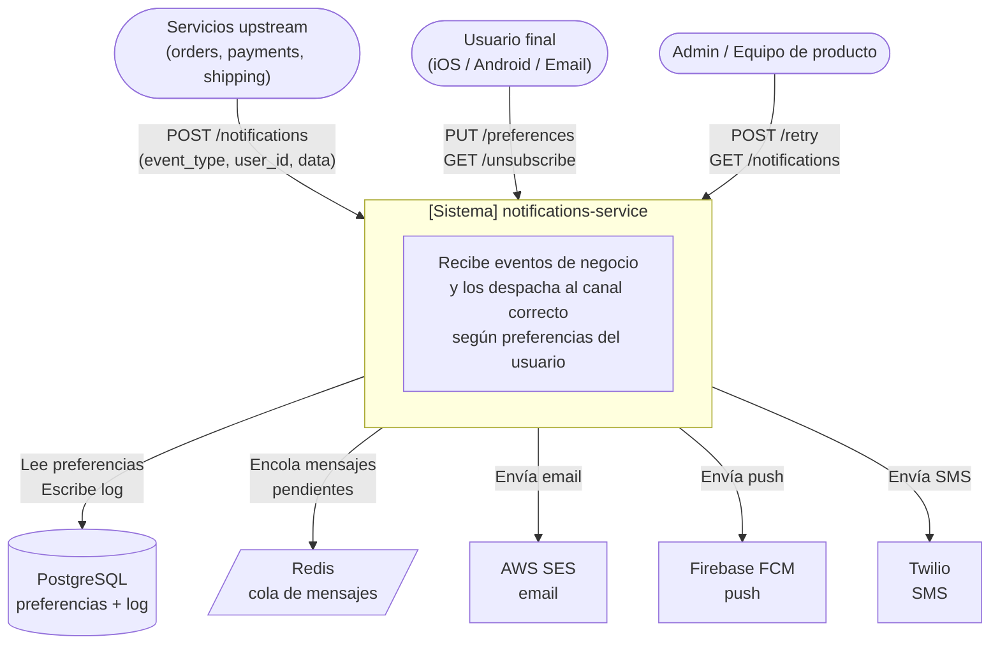
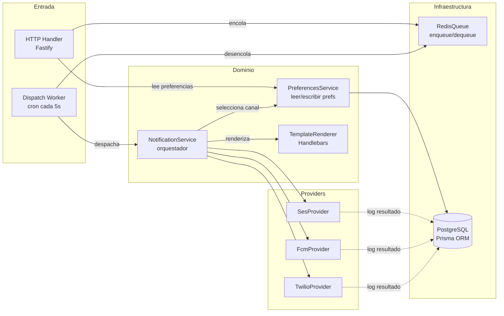
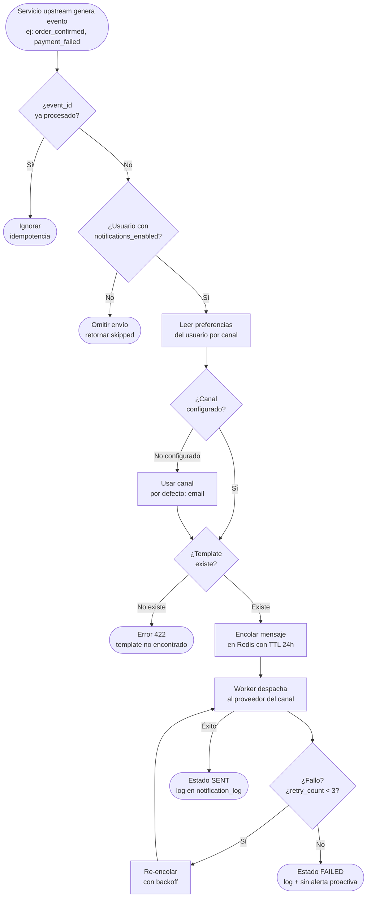
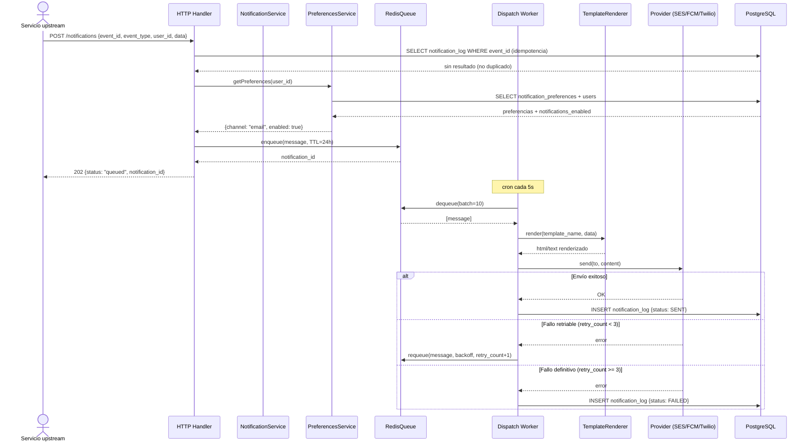
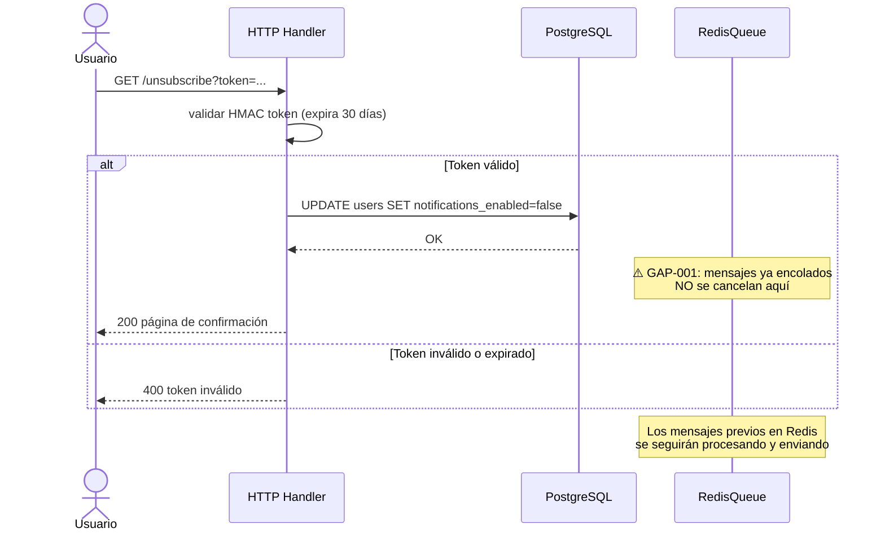
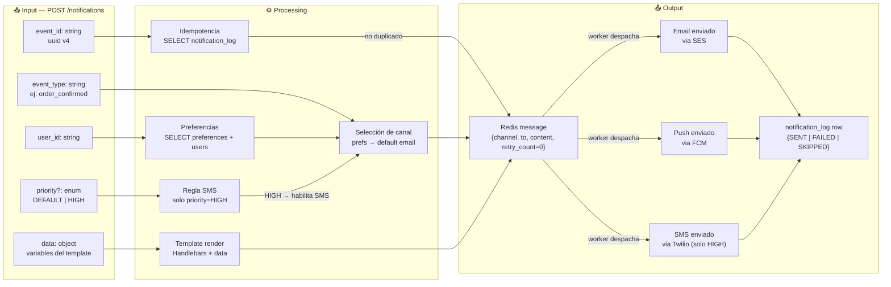
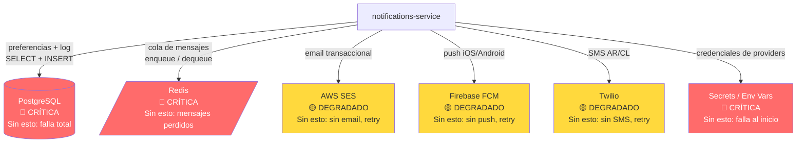
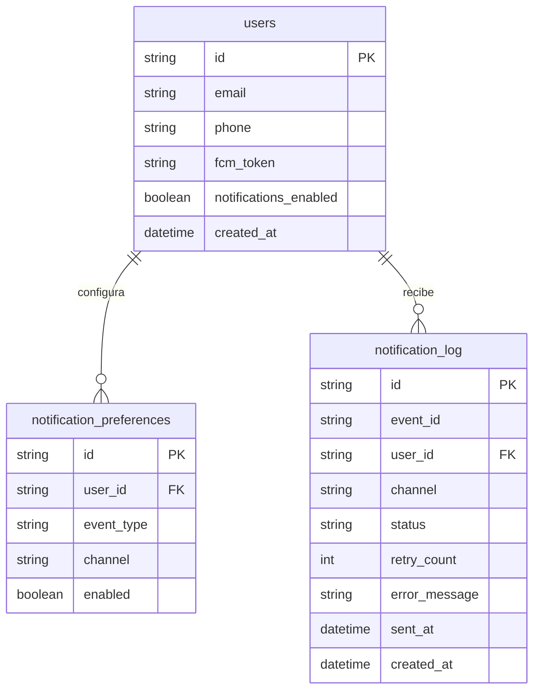

# Diagrams — notifications-service

**Actualizado:** 2026-06-24

---

## 1. Contexto del sistema

---

## 2. Componentes internos

---

## 3. Flujo de negocio — recepción y despacho

---

## 4. Secuencia — Flujo P0: Recepción y despacho completo

---

## 5. Secuencia — Unsubscribe (con gap documentado)

---

## 6. Flujo de datos — Input → Transformación → Output

---

## 7. Dependencias y modo de fallo

---

## 8. Modelo de datos

