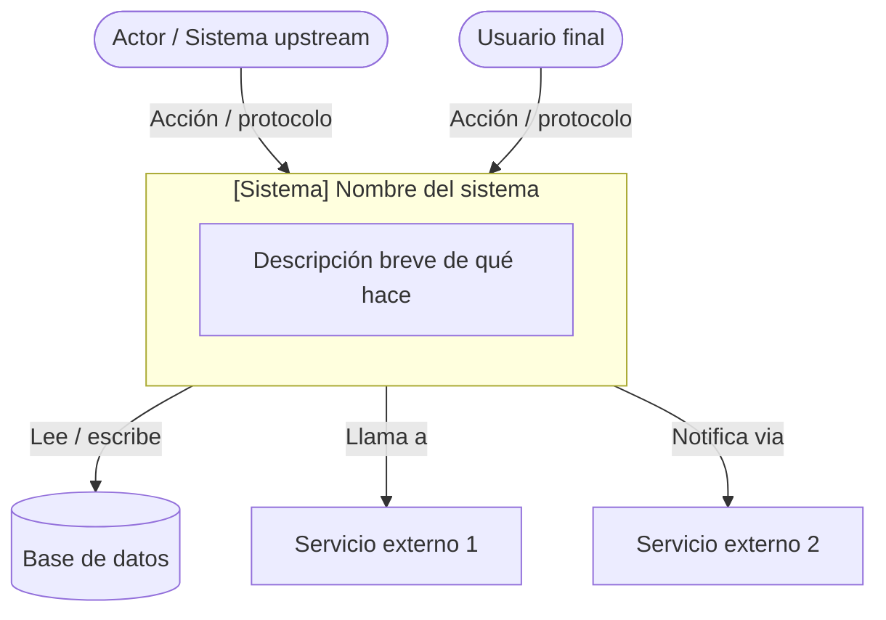
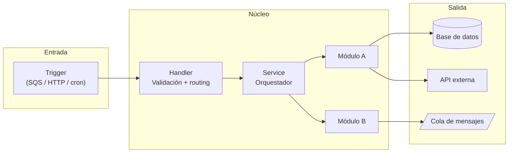
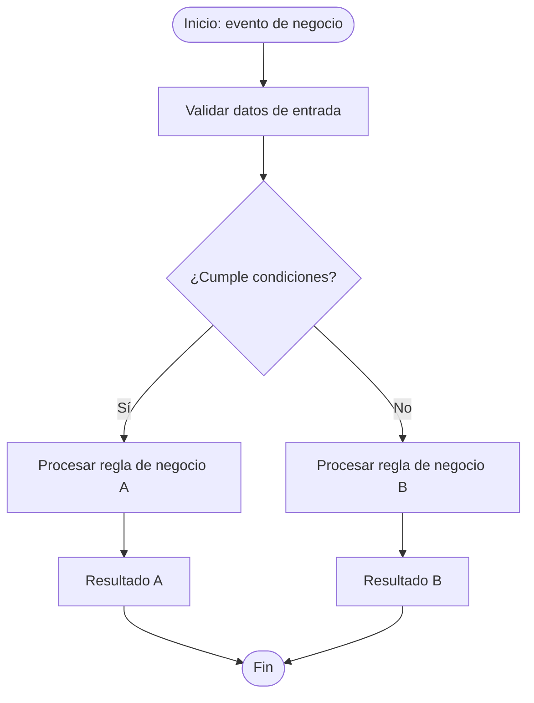
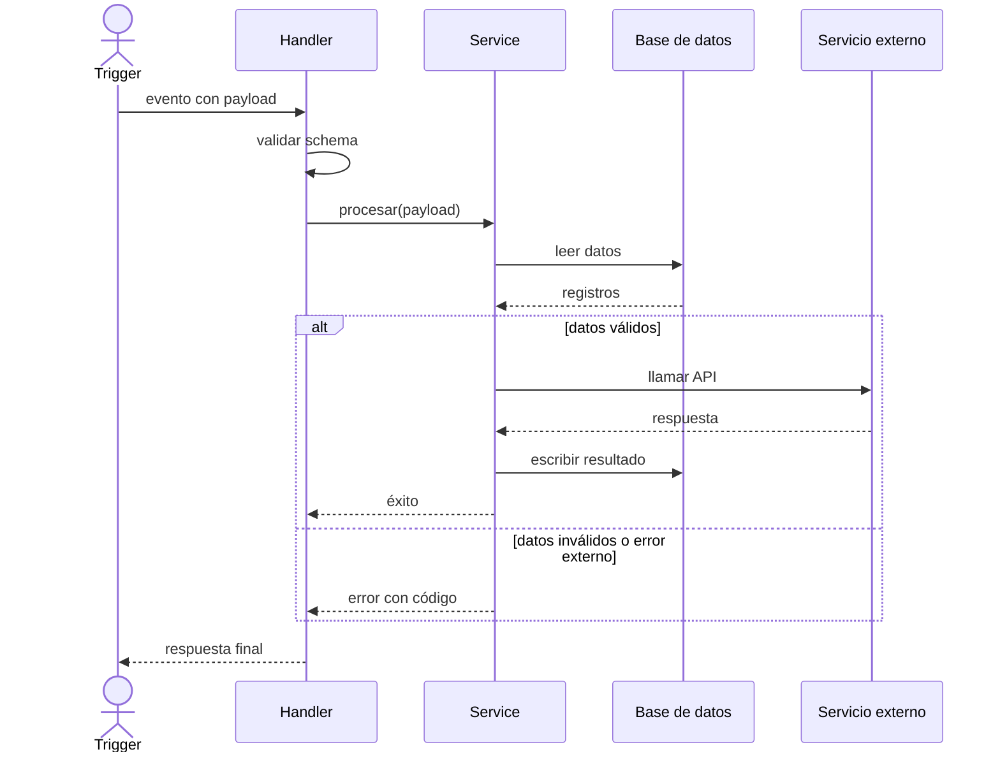
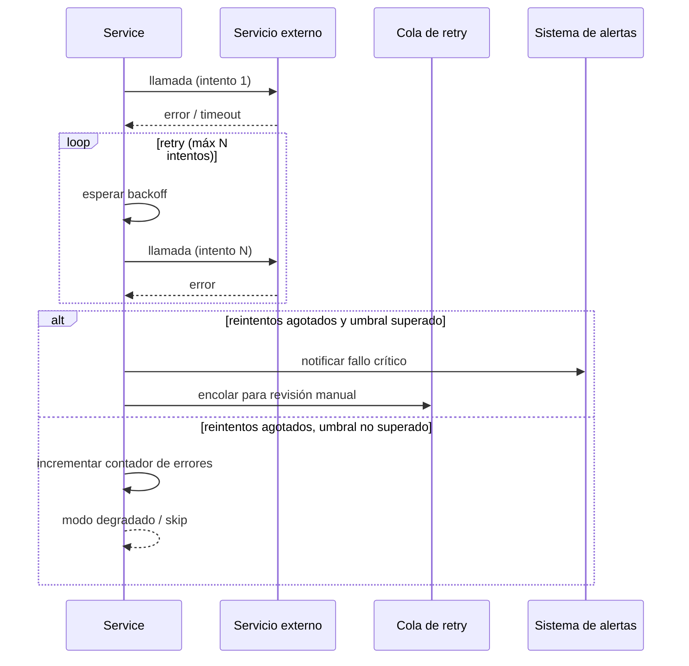
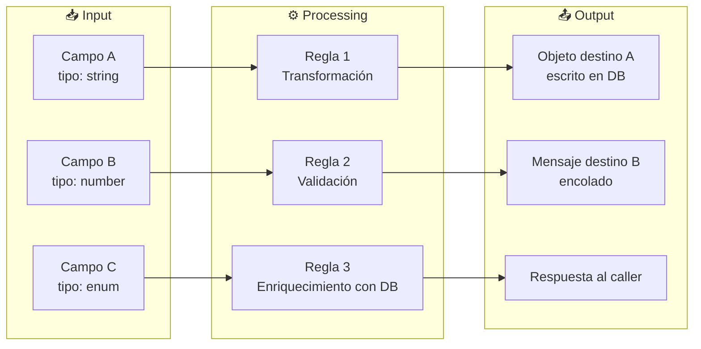
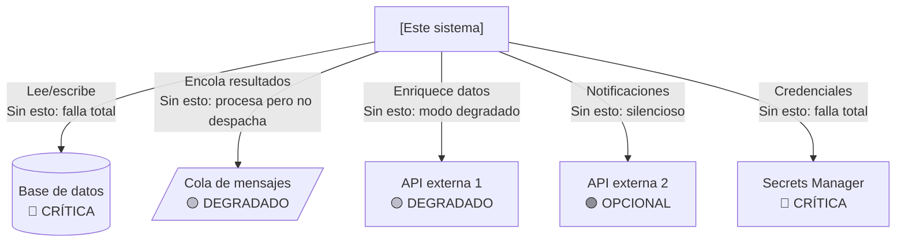
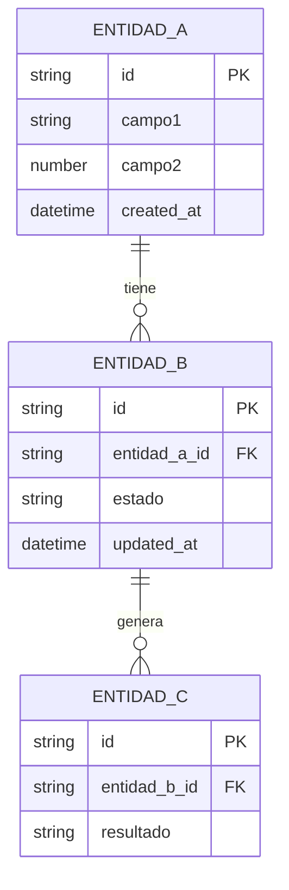

# Diagrams

**Actualizado:** UNKNOWN
**Formato:** Mermaid — renderiza en GitHub, GitLab, Notion y la mayoría de herramientas de documentación.
**Regla:** si el sistema cambia, los diagramas deben actualizarse en el mismo PR.

---

## 1. Contexto del sistema (C4 Level 1)

> Quién interactúa con el sistema desde afuera. Para stakeholders no técnicos.

---

## 2. Diagrama de componentes (C4 Level 2)

> Componentes internos y cómo se conectan entre sí.

---

## 3. Flujo de negocio — vista funcional

> Qué hace el sistema en términos de negocio, sin detalle técnico. Para product owners y stakeholders.

---

## 4. Diagrama de secuencia — Flujo P0 principal

> Interacciones entre componentes en el tiempo para el flujo crítico. Para desarrolladores.

---

## 5. Diagrama de secuencia — Flujo de error / retry

> Qué pasa cuando algo falla. Crítico para entender resiliencia del sistema.

---

## 6. Flujo de datos — Input → Processing → Output

> Qué datos entran, cómo se transforman, qué sale. Para entender el contrato del sistema.

---

## 7. Dependencias externas y criticidad

> Qué depende el sistema de afuera y qué pasa si cada dependencia falla.

---

## 8. Modelo de datos — entidades principales

> Qué tablas / colecciones usa el sistema y cómo se relacionan.

